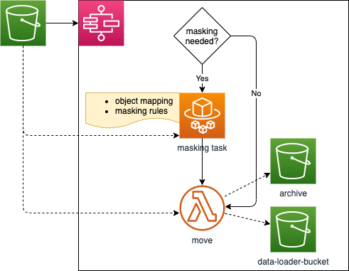

# salesforce-data-masking

Data masking framework.

## What it does

By setting up a masking rule against a specific folder in S3 bucket, this framework will be kicked off whenever there is a CSV file being dropped into the folder. Then every single field within each row will be masked according to the rule.

### Architecture



### Supported rules and settings
  
* Word
  
  ```json
  {
    "maskWith": "*",
    "wordDelimiter": " ",
    "unmaskedStartCharacters": 2,
    "unmaskedEndCharacters": 1
  }
  ```

* Card

  ```json
  {
    "maskWith": "*",
    "unmaskedStartDigits": 4,
    "unmaskedEndDigits": 1
  }
  ```

* Email

  ```json
  {
    "maskWith": "*",
    "unmaskedStartCharacters": 3,
    "unmaskedEndCharacters": 2,
    "maskAtTheRate": false,
    "maxMaskedCharactersBeforeAtTheRate": 10,
    "maxMaskedCharactersAfterAtTheRate": 10
  }
  ```

* Phone

  ```json
  {
    "maskWith": "*",
    "unmaskedStartDigits": 4,
    "unmaskedEndDigits": 1
  }
  ```

* String

  ```json
  {
    "maskWith": "*",
    "maskOnlyFirstOccurance": false,
    "values": []
  }
  ```

* Password

  ```json
  {
    "maskWith": "*",
    "maxMaskedCharacters": 16
  }
  ```

### CDK Issues

* Docker required to be running when deploy

  https://github.com/aws/aws-cdk/issues/8133

* ApplicationLoadBalancedFargateService fails to deploy in VPC with multiple subnets in same AZ

  https://github.com/aws/aws-cdk/issues/5892
